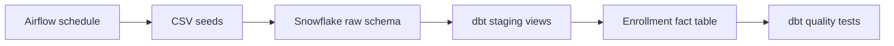

# Snowflake + dbt + Apache Airflow ELT Pipeline

A small, reproducible analytics engineering project that loads sample enrollment data into Snowflake, transforms it with dbt, validates key constraints, and provides an Airflow DAG for scheduled execution.

## Implemented flow



- Three sample source tables: students, courses, and enrollments
- Typed and standardized staging models
- Enriched `fct_student_course` mart built with dbt `ref()` dependencies
- Unique, not-null, accepted-value, and relationship tests
- Daily Airflow DAG with retries that runs `dbt seed` followed by `dbt build`
- Environment-variable based Snowflake profile example; no credentials committed
- Credential-free repository checks in GitHub Actions

## Repository structure

```text
├── dags/dbt_student_analytics.py
├── models/
│   ├── staging/
│   ├── marts/fct_student_course.sql
│   └── schema.yml
├── seeds/
├── scripts/validate_project.py
├── dbt_project.yml
└── profiles.example.yml
```

## Run with dbt

1. Create a Snowflake database, warehouse, role, and user.
2. Export `SNOWFLAKE_ACCOUNT`, `SNOWFLAKE_USER`, `SNOWFLAKE_PASSWORD`, and the optional role/database/warehouse variables shown in `profiles.example.yml`.
3. Copy `profiles.example.yml` to your dbt profiles directory as `profiles.yml`.
4. Install the dbt adapter and run the project:

```bash
python -m venv .venv
pip install "dbt-snowflake>=1.8,<2.0"
dbt seed
dbt build
```

`dbt build` materializes the staging views and fact table, then runs the declared data-quality tests.

## Run with Airflow

Place this project at the location specified by `DBT_PROJECT_DIR`, place `profiles.yml` in `DBT_PROFILES_DIR`, and add `dags/dbt_student_analytics.py` to the Airflow DAG folder. The default schedule is 06:00 UTC daily with two retries.

## Verification

Run the credential-free checks locally:

```bash
python -m py_compile dags/dbt_student_analytics.py
python scripts/validate_project.py
```

Live Snowflake execution requires your own account and is not performed by CI. The `labs/` directory preserves notes from the smaller practice repositories that were consolidated into this project.

