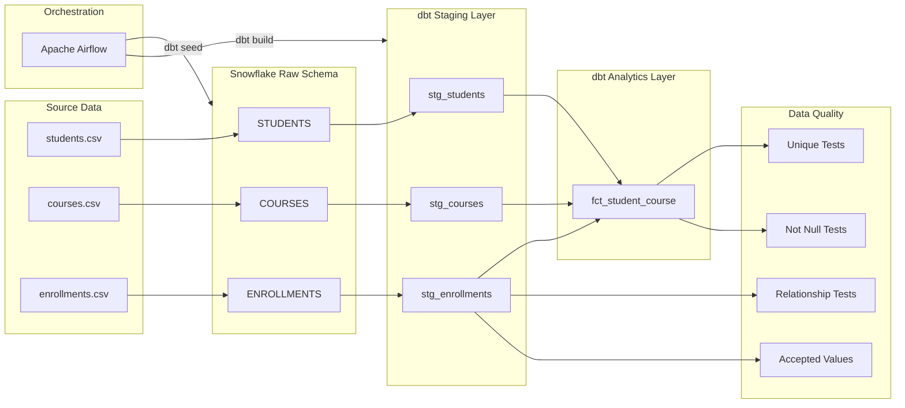
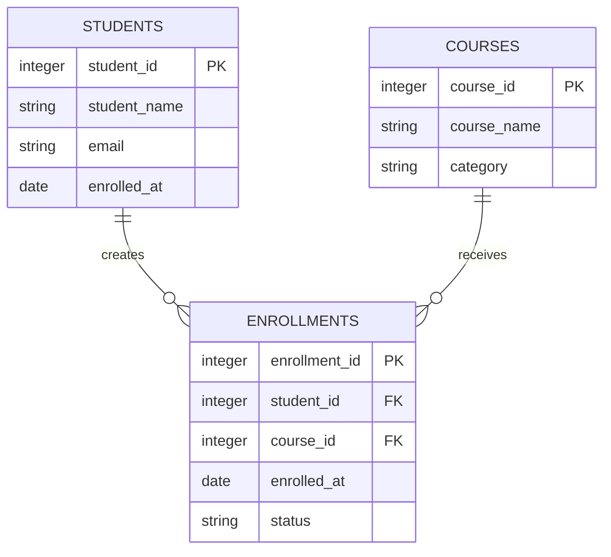
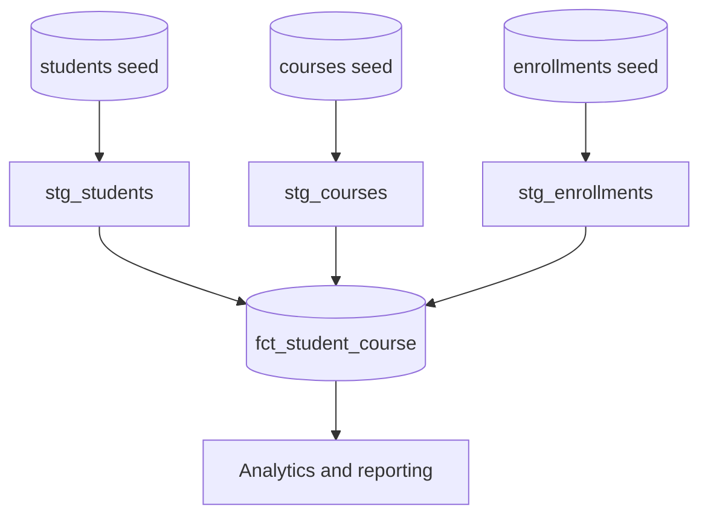
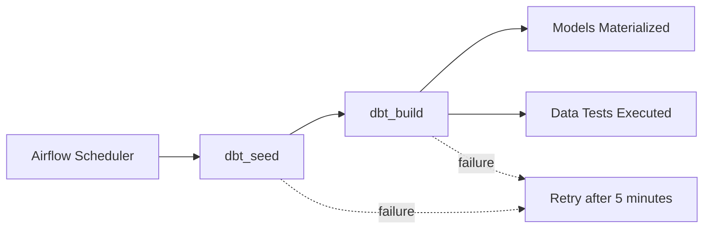

# Snowflake + dbt + Apache Airflow ELT Pipeline


A reproducible analytics engineering project that loads enrollment data into **Snowflake**, transforms it through modular **dbt** models, validates data quality, and schedules the workflow with **Apache Airflow**.

The repository demonstrates the core components of a modern ELT workflow:

```text
Extracted Data → Snowflake → dbt Transformations → Data Tests → Analytics Mart
                                    ▲
                                    │
                          Apache Airflow DAG
```

---

## Project Overview

Educational platforms often store students, courses, and enrollments as separate operational datasets.

Raw records are useful for storage, but reporting teams need a clean model that answers questions such as:

- Which students enrolled in each course?
- Which enrollments are active, completed, or cancelled?
- Are enrollment records linked to valid students and courses?
- Are duplicate students, courses, or enrollment events present?
- Can the transformation workflow run on a repeatable schedule?

This project addresses those requirements using Snowflake as the warehouse, dbt as the transformation and testing layer, and Airflow as the orchestrator.

---

## Architecture



---

## Technology Stack

| Layer | Technology | Responsibility |
|---|---|---|
| Data warehouse | Snowflake | Stores raw and transformed datasets |
| Transformation | dbt Core | Builds modular SQL models |
| Orchestration | Apache Airflow | Schedules and retries the workflow |
| Modeling | SQL | Creates staging and analytics models |
| Data quality | dbt tests | Validates keys, relationships and values |
| Configuration | YAML | Defines models, tests and project settings |
| Validation | Python | Performs credential-free repository checks |
| Version control | Git and GitHub | Tracks pipeline and model changes |

---

## ELT Workflow

### 1. Extract and load

The repository contains small synthetic CSV datasets representing:

- Students
- Courses
- Enrollment events

dbt seeds load these files into the configured Snowflake raw schema.

```bash
dbt seed --profiles-dir .
```

### 2. Transform

The staging models clean and standardize raw records:

```text
students.csv
    └── stg_students

courses.csv
    └── stg_courses

enrollments.csv
    └── stg_enrollments
```

The final fact model combines all three staging models:

```text
stg_students ────────┐
                     │
stg_courses ─────────┼──► fct_student_course
                     │
stg_enrollments ─────┘
```

### 3. Test

dbt validates the transformed data during `dbt build`.

Tests include:

- Primary keys are not null
- Primary keys are unique
- Student email addresses are unique
- Enrollment status contains accepted values
- Every enrollment references a valid student
- Every enrollment references a valid course

### 4. Orchestrate

The Airflow DAG runs:

```text
dbt_seed → dbt_build
```

The workflow is scheduled daily at **06:00 UTC** and retries failed tasks twice with a five-minute delay.

---

## Data Model

### Source entities



### Analytics fact table

The `fct_student_course` model produces one enriched record per enrollment.

| Column | Description |
|---|---|
| `enrollment_id` | Unique enrollment event |
| `enrolled_at` | Enrollment date |
| `status` | Active, completed, or cancelled |
| `student_id` | Student identifier |
| `student_name` | Standardized student name |
| `email` | Normalized student email |
| `course_id` | Course identifier |
| `course_name` | Course title |
| `category` | Course category |

---

## dbt Model Lineage



### Staging layer

Staging models are materialized as Snowflake views.

#### `stg_students`

```sql
select
    cast(student_id as integer) as student_id,
    trim(student_name) as student_name,
    lower(trim(email)) as email,
    cast(enrolled_at as date) as enrolled_at
from {{ ref('students') }}
where student_id is not null
```

Responsibilities:

- Casts identifiers to integer
- Removes surrounding whitespace
- Normalizes emails to lowercase
- Converts enrollment timestamps to dates
- Removes records without a student ID

#### `stg_courses`

Responsibilities:

- Casts course IDs
- Standardizes course names
- Cleans category values
- Removes invalid course identifiers

#### `stg_enrollments`

Responsibilities:

- Casts enrollment and foreign keys
- Converts enrollment dates
- Standardizes status values to uppercase
- Removes records without an enrollment ID

### Mart layer

The analytics mart is materialized as a Snowflake table.

```sql
with enrollments as (
    select * from {{ ref('stg_enrollments') }}
),

students as (
    select * from {{ ref('stg_students') }}
),

courses as (
    select * from {{ ref('stg_courses') }}
)

select
    e.enrollment_id,
    e.enrolled_at,
    e.status,
    s.student_id,
    s.student_name,
    s.email,
    c.course_id,
    c.course_name,
    c.category
from enrollments e
inner join students s
    on e.student_id = s.student_id
inner join courses c
    on e.course_id = c.course_id
```

Using dbt `ref()` creates an explicit dependency graph and ensures upstream models build before the final mart.

---

## Data Quality Tests

Tests are declared in [`models/schema.yml`](models/schema.yml).

| Model | Column | Validation |
|---|---|---|
| `stg_students` | `student_id` | Not null and unique |
| `stg_students` | `email` | Not null and unique |
| `stg_courses` | `course_id` | Not null and unique |
| `stg_enrollments` | `enrollment_id` | Not null and unique |
| `stg_enrollments` | `student_id` | Must exist in `stg_students` |
| `stg_enrollments` | `course_id` | Must exist in `stg_courses` |
| `stg_enrollments` | `status` | Accepted values only |
| `fct_student_course` | `enrollment_id` | Not null and unique |
| `fct_student_course` | `student_id` | Not null |
| `fct_student_course` | `course_id` | Not null |

Accepted enrollment statuses:

```text
ACTIVE
COMPLETED
CANCELLED
```

Running the following command builds models and executes all declared tests:

```bash
dbt build --profiles-dir .
```

---

## Airflow Orchestration

The DAG is defined in:

[`dags/dbt_student_analytics.py`](dags/dbt_student_analytics.py)



### DAG configuration

| Setting | Value |
|---|---|
| DAG ID | `snowflake_dbt_student_analytics` |
| Schedule | Daily at 06:00 UTC |
| Catchup | Disabled |
| Retries | 2 |
| Retry delay | 5 minutes |
| Tags | Snowflake, dbt, analytics |

The Airflow environment reads the following paths from environment variables:

```text
DBT_PROJECT_DIR
DBT_PROFILES_DIR
```

Default locations:

```text
DBT_PROJECT_DIR=/opt/airflow/dbt/student_analytics
DBT_PROFILES_DIR=/opt/airflow/dbt
```

---

## Repository Structure

```text
snowflake-dbt-data-engineering/
│
├── dags/
│   └── dbt_student_analytics.py
│
├── models/
│   ├── staging/
│   │   ├── stg_students.sql
│   │   ├── stg_courses.sql
│   │   └── stg_enrollments.sql
│   │
│   ├── marts/
│   │   └── fct_student_course.sql
│   │
│   └── schema.yml
│
├── seeds/
│   ├── students.csv
│   ├── courses.csv
│   └── enrollments.csv
│
├── scripts/
│   └── validate_project.py
│
├── labs/
│   ├── airflow-projects/
│   ├── dbt-projects/
│   ├── snowflake-projects/
│   └── snowflake-dbt-data-engineering/
│
├── dbt_project.yml
├── profiles.example.yml
├── requirements.txt
├── .gitignore
└── README.md
```

The `labs/` directory records the smaller learning repositories that were consolidated into this project.

---

## Snowflake Configuration

The repository includes [`profiles.example.yml`](profiles.example.yml), which reads credentials from environment variables.

```yaml
student_analytics:
  target: dev
  outputs:
    dev:
      type: snowflake
      account: "{{ env_var('SNOWFLAKE_ACCOUNT') }}"
      user: "{{ env_var('SNOWFLAKE_USER') }}"
      password: "{{ env_var('SNOWFLAKE_PASSWORD') }}"
      role: "{{ env_var('SNOWFLAKE_ROLE', 'TRANSFORMER') }}"
      database: "{{ env_var('SNOWFLAKE_DATABASE', 'ANALYTICS') }}"
      warehouse: "{{ env_var('SNOWFLAKE_WAREHOUSE', 'COMPUTE_WH') }}"
      schema: dbt_dev
      threads: 4
```

Credentials are not hard-coded or committed.

---

## How to Run

### Prerequisites

- Python 3.10 or newer
- Snowflake account
- Snowflake database and warehouse
- User with permission to create schemas, views and tables
- dbt Core with the Snowflake adapter
- Apache Airflow for orchestration

### 1. Clone the repository

```bash
git clone https://github.com/syedsaud15/snowflake-dbt-data-engineering.git
cd snowflake-dbt-data-engineering
```

### 2. Create a virtual environment

```bash
python -m venv .venv
```

Activate it:

```bash
# Windows
.venv\Scripts\activate

# macOS/Linux
source .venv/bin/activate
```

### 3. Install the dbt adapter

For dbt-only execution:

```bash
pip install "dbt-snowflake>=1.8,<2.0"
```

Install Apache Airflow separately inside the Airflow runtime where the DAG will execute.

### 4. Configure Snowflake variables

```bash
export SNOWFLAKE_ACCOUNT="your_account"
export SNOWFLAKE_USER="your_user"
export SNOWFLAKE_PASSWORD="your_password"
export SNOWFLAKE_ROLE="TRANSFORMER"
export SNOWFLAKE_DATABASE="ANALYTICS"
export SNOWFLAKE_WAREHOUSE="COMPUTE_WH"
```

PowerShell:

```powershell
$env:SNOWFLAKE_ACCOUNT="your_account"
$env:SNOWFLAKE_USER="your_user"
$env:SNOWFLAKE_PASSWORD="your_password"
$env:SNOWFLAKE_ROLE="TRANSFORMER"
$env:SNOWFLAKE_DATABASE="ANALYTICS"
$env:SNOWFLAKE_WAREHOUSE="COMPUTE_WH"
```

### 5. Create the local dbt profile

```bash
cp profiles.example.yml profiles.yml
```

PowerShell:

```powershell
Copy-Item profiles.example.yml profiles.yml
```

`profiles.yml` is excluded by `.gitignore`.

### 6. Validate the Snowflake connection

```bash
dbt debug --profiles-dir .
```

### 7. Load sample data

```bash
dbt seed --profiles-dir .
```

### 8. Build models and run tests

```bash
dbt build --profiles-dir .
```

### 9. Generate dbt documentation

```bash
dbt docs generate --profiles-dir .
dbt docs serve --profiles-dir .
```

The generated documentation displays model descriptions, columns, tests and lineage.

---

## Expected Build Order

dbt determines the correct execution order through `ref()` dependencies:

```text
1. students
2. courses
3. enrollments
4. stg_students
5. stg_courses
6. stg_enrollments
7. fct_student_course
8. Schema and relationship tests
```

---

## Local Repository Validation

A credential-free validation script checks that:

- Required dbt files exist
- Required Airflow files exist
- Seed files contain data
- The final mart references every required staging model

Run:

```bash
python scripts/validate_project.py
```

Validate the Airflow DAG’s Python syntax:

```bash
python -m py_compile dags/dbt_student_analytics.py
```

These checks do not connect to Snowflake and do not replace `dbt build`.

---

## Engineering Decisions

### Why Snowflake?

Snowflake separates storage from compute and provides a managed SQL warehouse for analytical workloads.

### Why dbt?

dbt keeps transformation logic in modular, version-controlled SQL models. Its dependency graph ensures models run in the correct order.

### Why staging views?

Staging views provide a clean interface over raw data without creating unnecessary copies of small intermediate datasets.

### Why materialize the mart as a table?

The final mart is intended for repeated analytical queries. Table materialization avoids recomputing all joins for every dashboard request.

### Why use relationship tests?

An enrollment without a valid student or course would produce misleading reporting results. Relationship tests detect these orphaned records before the mart is trusted.

### Why separate orchestration from transformation?

dbt owns SQL transformation and testing. Airflow owns scheduling, retries and task sequencing. Keeping these responsibilities separate makes failures easier to locate.

---

## Security Practices

- Snowflake credentials are loaded from environment variables.
- `profiles.yml` is excluded from version control.
- No passwords, account identifiers or tokens are committed.
- Sample records use synthetic names and email addresses.
- Airflow paths are configurable through environment variables.

---

## Current Limitations

This is a portfolio implementation and requires a Snowflake account for full execution.

The repository currently does not include:

- Infrastructure as Code
- A Docker-based Airflow environment
- A live Snowflake execution report
- Dashboard screenshots
- Automated deployment to a hosted Airflow instance
- Production-scale performance benchmarks
- Incremental dbt models or snapshots

These boundaries are documented so the project does not claim deployment or scale that the repository cannot prove.

---

## Possible Extensions

- Add incremental dbt models for enrollment events
- Add dbt snapshots for historical status tracking
- Add freshness checks for external sources
- Add a Docker Compose Airflow environment
- Add Snowflake query-cost monitoring
- Add BI dashboards over the final mart
- Add deployment automation for dbt and Airflow
- Add a larger synthetic data generator

---

## Author

**Syed Saud Alam**  
Data Engineer focused on Python, SQL, PySpark, Databricks, Snowflake, dbt, Apache Airflow, and cloud data platforms.

- [GitHub](https://github.com/syedsaud15)
- [Portfolio](https://syedsaud15.github.io/syed-saud-portfolio/)
